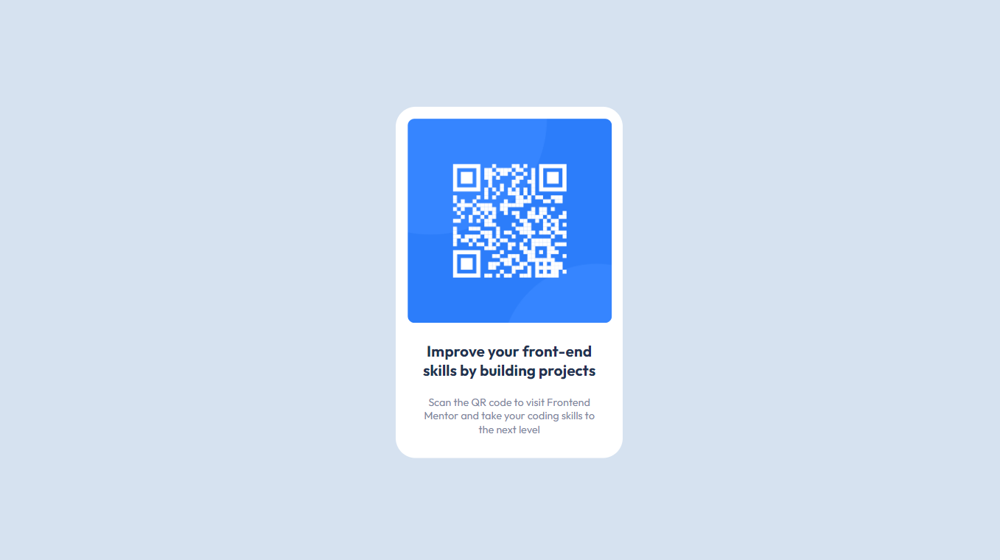

# Frontend Mentor - QR code component solution

This is a solution to the [QR code component challenge on Frontend Mentor](https://www.frontendmentor.io/challenges/qr-code-component-iux_sIO_H). Frontend Mentor challenges help you improve your coding skills by building realistic projects. 

## Table of contents

- [Overview](#overview)
  - [The challenge](#the-challenge)
  - [Screenshot](#screenshot)
  - [Links](#links)
- [My process](#my-process)
  - [Built with](#built-with)
- [Author](#author)

### Screenshot

| The design                            | My work                               |
|---------------------------------------|---------------------------------------|
| |         |
|  |           |

<!-- ### Links

- Solution URL: [Add solution URL here](https://your-solution-url.com)
- Live Site URL: [Add live site URL here](https://your-live-site-url.com)
-->

## My process

### Built with

- Semantic HTML5 markup
- CSS custom properties
- Flexbox
- Google fonts

## Author

- Linkedin - [Joey Bervin](https://www.linkedin.com/in/joey-bervin/)
- Frontend Mentor - [BeJoy ](https://www.frontendmentor.io/profile/Joeybervin)