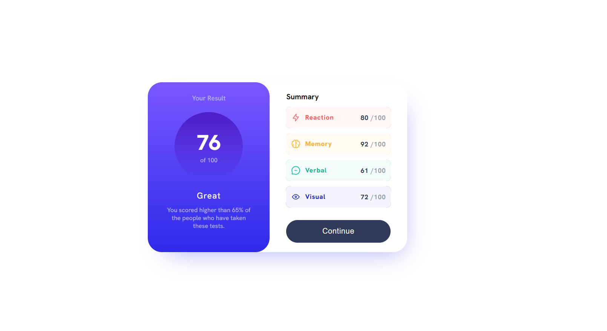
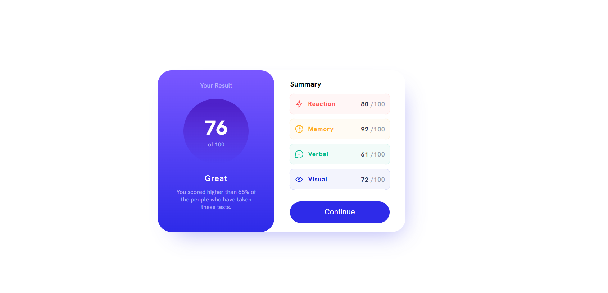
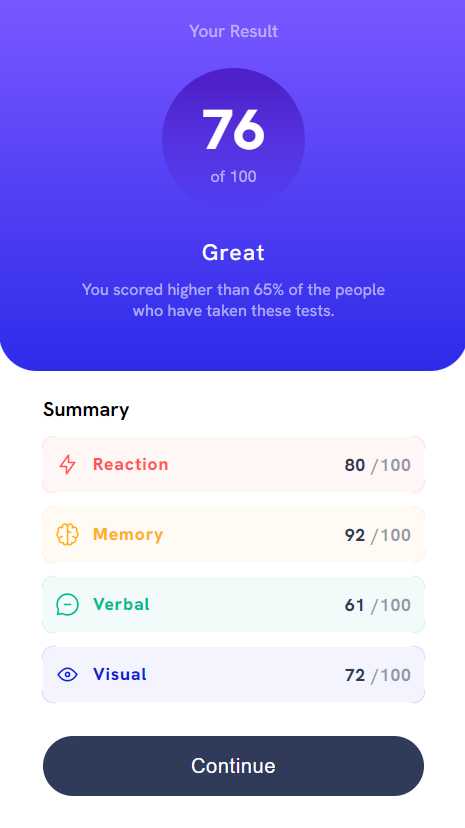

# Frontend Mentor - Results summary component solution


This is a solution to the [Results summary component challenge on Frontend Mentor](https://www.frontendmentor.io/challenges/results-summary-component-CE_K6s0maV). Frontend Mentor challenges help you improve your coding skills by building realistic projects. 

## Table of contents

- [Overview](#overview)
  - [The challenge](#the-challenge)
  - [Screenshot](#screenshot)
  - [Links](#links)
- [My process](#my-process)
  - [Built with](#built-with)
  - [What I learned](#what-i-learned)
- [Author](#author)


## Overview


### The challenge

Users should be able to:

- View the optimal layout for the interface depending on their device's screen size
- See hover and focus states for all interactive elements on the page

### Screenshot


| The design                            | My work                               |
|---------------------------------------|---------------------------------------|
| |         |
|  |   |
|  |           |

### Links

- Solution URL: [Add solution URL here](https://your-solution-url.com)
- Live Site URL: [Add live site URL here](https://your-live-site-url.com)

## My process

### Built with

- Semantic HTML5 markup
- CSS custom properties
- Flexbox
- Mobile-first workflow
- Javascript

### What I learned

I learned about CSS custom properties.

To see how you can add code snippets, see below:

```css
@property --num {
    syntax: "<integer>";
    initial-value: 0;
    inherits: false;
}
```

### Useful resources


## Author

- Linkedin - [Add your name here](https://www.linkedin.com/in/joey-bervin/)
- Frontend Mentor - [Joey ](https://www.frontendmentor.io/profile/Joeybervin)
